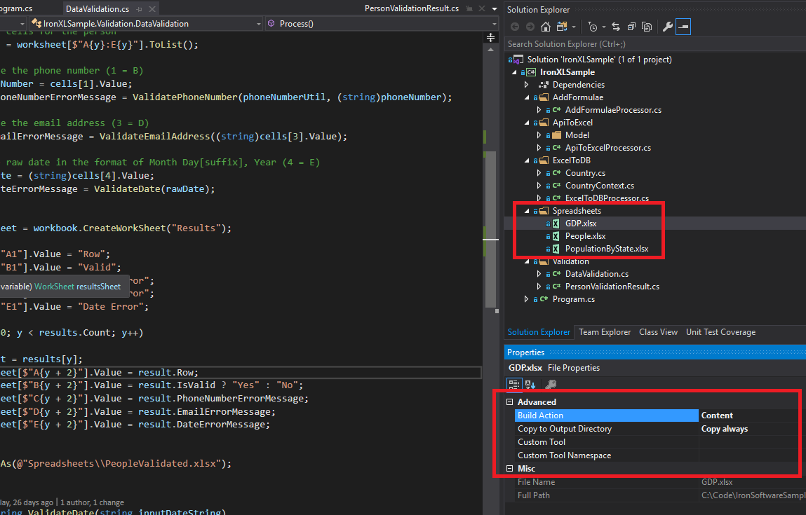
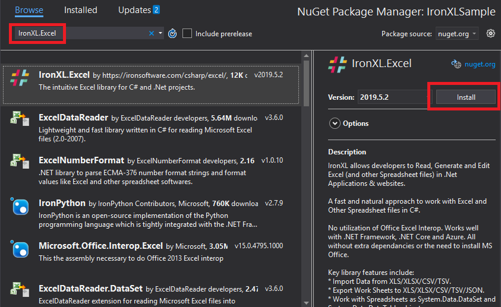
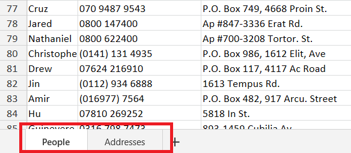
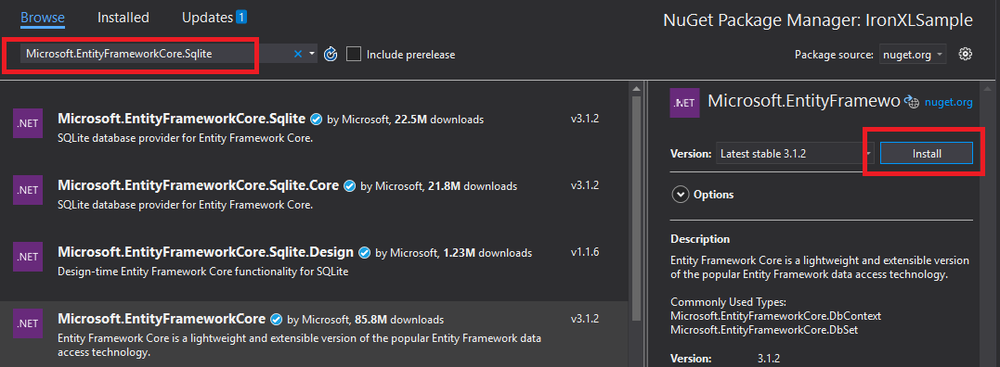
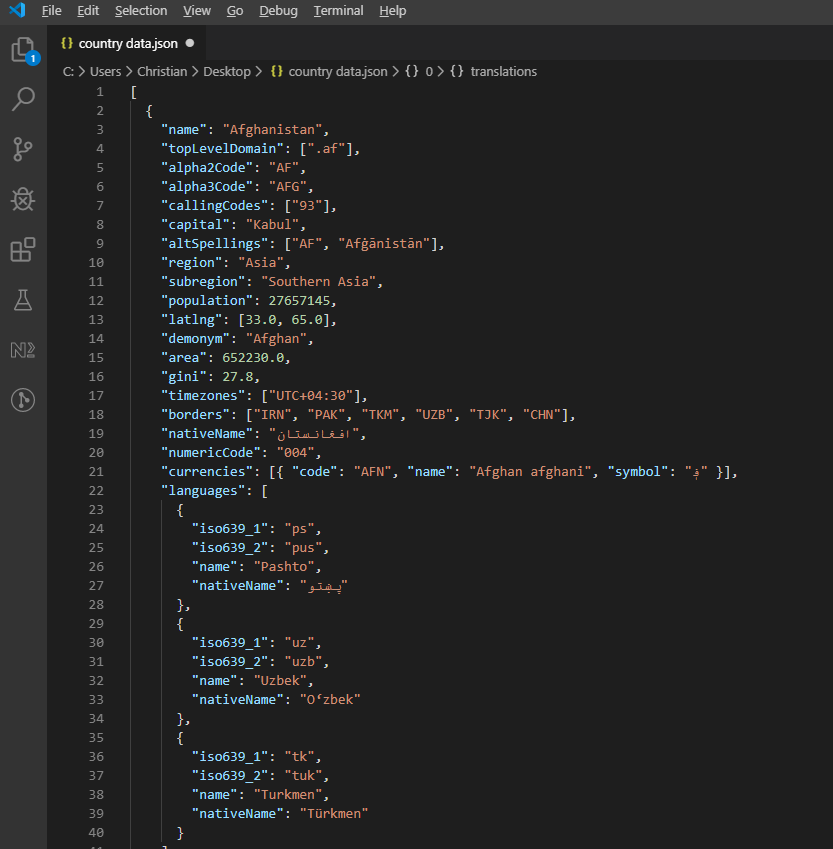

# How to use Excel Spreadsheets in C# #
IronXL is a .NET library that facilitates reading and editing Microsoft Excel documents with C#. This tutorial explains how to how to read data from excel in C# and use the library for everyday tasks like validation, conversion to a database, saving data from Web APIs, and modifying formulae within the spreadsheet. This article references the IronXL code samples, which is a .NET Core Console App. Please clone these from Github. 

The samples contain three Excel spreadsheets.



## Installing the IronXL Nuget Package ##

- In Visual Studio, right-click on the project select "Manage Nuget Packages ..."
- Search for the IronXL.Excel package and install 



Alternatively, 

- Enter the Package Manager Console
- Type > Install-Package IronXL.Excel

## Loading a WorkBook and Getting a WorkSheet ##

The [`WorkBook`](https://ironsoftware.com/csharp/excel/object-reference/html/T_IronXL_WorkBook.htm) class represents an Excel spreadsheet. To open a WorkBook, use WorkBook.Load and specify the path of the Excel file (.xlsx)

```cs
var workbook = WorkBook.Load(@"Spreadsheets\\GDP.xlsx");
```
Sample: *ExcelToDBProcessor*

Each WorkBook can have multiple [`WorkSheet`](https://ironsoftware.com/csharp/excel/object-reference/html/T_IronXL_WorkSheet.htm) objects. These represent worksheets in the Excel document. If the spreadsheet contains worksheets, retrieve them by name [`WorkBook.GetWorkSheet`](https://ironsoftware.com/csharp/excel/object-reference/html/M_IronXL_WorkBook_GetWorkSheet.htm). 

```cs
var worksheet = workbook.GetWorkSheet("GDPByCountry");
```
Sample: *ExcelToDB*

## Creating a WorkBook ##

To create a new WorkBook in memory, construct a new WorkBook with the spreadsheet type. 

```cs
var workbook = new WorkBook(ExcelFileFormat.XLSX);
```
Sample: *ApiToExcelProcessor*

*Note: Use ExcelFileFormat.XLS for legacy for Excel spreadsheets (95 and earlier)

## Creating a WorkSheet ##

Each `WorkBook` can have multiple WorkSheets. A `WorkSheet` is a sheet of data, while a WorkBook represents a collection of `WorkSheet`s. This is how one workbook with two worksheets looks in Excel:



To create a new `WorkSheet` call `WorkBook.CreateWorkSheet` and pass the name of the worksheet

```cs
var worksheet = workbook.CreateWorkSheet("Countries");
```

## Get Cell Range ##

The `Range` class represents a two-dimensional collection of `Cell` objects. It represents a literal range of Excel cells. Obtain ranges by using the string indexer on a `WorkSheet` object. The argument text is either the coordinate of a cell (e.g. "A1") or a span of cells from left to right top to bottom (e.g. "B2:E5").  It is also possible to call `GetRange` on a `WorkSheet`

```cs
var range = worksheet["D2:D101"];
```
Sample: *DataValidation*

## Iterate through Cells in Range ##

There are several ways to read or edit the values of cells within a `Range`. If the count is known, use a For loop.

```cs
//Iterate through the rows
for (var y = 2; y <= 101; y++)
{
    var result = new PersonValidationResult { Row = y };
    results.Add(result);

    //Get all cells for the person
    var cells = worksheet[$"A{y}:E{y}"].ToList();

    //Validate the phone number (1 = B)
    var phoneNumber = cells[1].Value;
    result.PhoneNumberErrorMessage = ValidatePhoneNumber(phoneNumberUtil, (string)phoneNumber);

    //Validate the email address (3 = D)
    result.EmailErrorMessage = ValidateEmailAddress((string)cells[3].Value);

    //Get the raw date in the format of Month Day[suffix], Year (4 = E)
    var rawDate = (string)cells[4].Value;
    result.DateErrorMessage = ValidateDate(rawDate);
}
```

Sample: *DataValidation*

## Validate Data in Cells ##

Use IronXL to validate a spreadsheet of data. The DataValidation sample uses `libphonenumber-csharp` to validate phone numbers and uses standard C# APIs to validate email addresses and dates.

```cs
//Iterate through the rows
for (var i = 2; i <= 101; i++)
{
    var result = new PersonValidationResult { Row = i };
    results.Add(result);

    //Get all cells for the person
    var cells = worksheet[$"A{i}:E{i}"].ToList();

    //Validate the phone number (1 = B)
    var phoneNumber = cells[1].Value;
    result.PhoneNumberErrorMessage = ValidatePhoneNumber(phoneNumberUtil, (string)phoneNumber);

    //Validate the email address (3 = D)
    result.EmailErrorMessage = ValidateEmailAddress((string)cells[3].Value);

    //Get the raw date in the format of Month Day[suffix], Year (4 = E)
    var rawDate = (string)cells[4].Value;
    result.DateErrorMessage = ValidateDate(rawDate);
}
```

The above code loops through each row in the spreadsheet and grabs the cells as a list. Each validates method checks the value of a cell and returns an error message if the value is invalid. 

This code creates a new spreadsheet, specifies headers, and outputs the error message results so that there is a log of invalid data.

```cs
var resultsSheet = workbook.CreateWorkSheet("Results");

resultsSheet["A1"].Value = "Row";
resultsSheet["B1"].Value = "Valid";
resultsSheet["C1"].Value = "Phone Error";
resultsSheet["D1"].Value = "Email Error";
resultsSheet["E1"].Value = "Date Error";

for (var i = 0; i < results.Count; i++)
{
    var result = results[i];
    resultsSheet[$"A{i + 2}"].Value = result.Row;
    resultsSheet[$"B{i + 2}"].Value = result.IsValid ? "Yes" : "No";
    resultsSheet[$"C{i + 2}"].Value = result.PhoneNumberErrorMessage;
    resultsSheet[$"D{i + 2}"].Value = result.EmailErrorMessage;
    resultsSheet[$"E{i + 2}"].Value = result.DateErrorMessage;
}

workbook.SaveAs(@"Spreadsheets\\PeopleValidated.xlsx");
```
## Export Data to a Database from Excel using Entity Framework ##

Use IronXL to export data to a database or convert an Excel spreadsheet to a database. The `ExcelToDB` sample reads a spreadsheet with GDP by country and then exports that data to an SQLite database. It uses EntityFramework to build the database and then export the data line by line.

Add the SQLite Entity Framework NuGet packages.



EntityFramework allows you to create a model object that can export data to the database.

```cs
public class Country
{
    [Key]
    public Guid Key { get; set; }
    public string Name { get; set; }
    public decimal GDP { get; set; }
}
```

This code configures the database context. To use a different database, install the corresponding NuGet package and find the equivalent  of `UseSqLite()`

```cs
public class CountryContext : DbContext
{
    public DbSet<Country> Countries { get; set; }

    public CountryContext()
    {
        //TODO: Make async
        Database.EnsureCreated();
    }

    /// <summary>
    /// Configure context to use Sqlite
    /// </summary>
    /// <param name="optionsBuilder"></param>
    protected override void OnConfiguring(DbContextOptionsBuilder optionsBuilder)
    {
        var connection = new SqliteConnection($"Data Source=Country.db");
        connection.Open();

        var command = connection.CreateCommand();

        //Create the database if it doesn't already exist
        command.CommandText = $"PRAGMA foreign_keys = ON;";
        command.ExecuteNonQuery();

        optionsBuilder.UseSqlite(connection);

        base.OnConfiguring(optionsBuilder);
    }

}
```

Create a `CountryContext`, iterate through the range to create each record, and then `SaveAsync` to commit data to the database

```cs
public async Task ProcessAsync()
{
    //Get the first worksheet
    var workbook = WorkBook.Load(@"Spreadsheets\\GDP.xlsx");
    var worksheet = workbook.GetWorkSheet("GDPByCountry");

    //Create the database connection
    using (var countryContext = new CountryContext())
    {
        //Iterate through all the cells
        for (var i = 2; i <= 213; i++)
        {
            //Get the range from A-B
            var range = worksheet[$"A{i}:B{i}"].ToList();

            //Create a Country entity to be saved to the database
            var country = new Country
            {
                Name = (string)range[0].Value,
                GDP = (decimal)(double)range[1].Value
            };

            //Add the entity 
            await countryContext.Countries.AddAsync(country);
        }

        //Commit changes to the database
        await countryContext.SaveChangesAsync();
    }
}
```
Sample: *ExcelToDB*

## Add Formulae to a Spreadsheet ##

Set formula of [`Cell`](https://ironsoftware.com/csharp/excel/object-reference/html/T_IronXL_Cells_Cell.htm)'s with the [`Formula`](https://ironsoftware.com/csharp/excel/object-reference/html/P_IronXL_Cells_Cell_Formula.htm) property. 

The code below iterates through each state and puts a percentage total in column C.

```cs
//Iterate through all rows with a value
for (var y = 2; y < i; y++)
{
    //Get the C cell
    var cell = sheet[$"C{y}"].First();

    //Set the formula for the Percentage of Total column
    cell.Formula = $"=B{y}/B{i}";
}
```
Sample: *AddFormulaeProcessor*

## Download Data from an API to Spreadsheet ##

The following call makes a REST call with [RestClient.Net](https://github.com/MelbourneDeveloper/RestClient.Net). It downloads JSON and converts it into a `List` of the type `RestCountry`. It is then easy to iterate through each country and save the data from the REST API to an Excel spreadsheet.

```cs
var client = new Client(new Uri("https://restcountries.eu/rest/v2/"));
List<RestCountry> countries = await client.GetAsync<List<RestCountry>>();
```
Sample: *ApiToExcel*

This is what the API JSON data looks like.



The following code iterates through the countries and sets the Name, Population, Region, NumericCode, and Top 3 Languages in the spreadsheet.

```cs
for (var i = 2; i < countries.Count; i++)
{
    var country = countries[i];

    //Set the basic values
    worksheet[$"A{i}"].Value = country.name;
    worksheet[$"B{i}"].Value = country.population;
    worksheet[$"G{i}"].Value = country.region;
    worksheet[$"H{i}"].Value = country.numericCode;

    //Iterate through languages
    for (var x = 0; x < 3; x++)
    {
        if (x > (country.languages.Count - 1)) break;

        var language = country.languages[x];

        //Get the letter for the column
        var columnLetter = GetColumnLetter(4 + x);

        //Set the language name
        worksheet[$"{columnLetter}{i}"].Value = language.name;
    }
}
```
